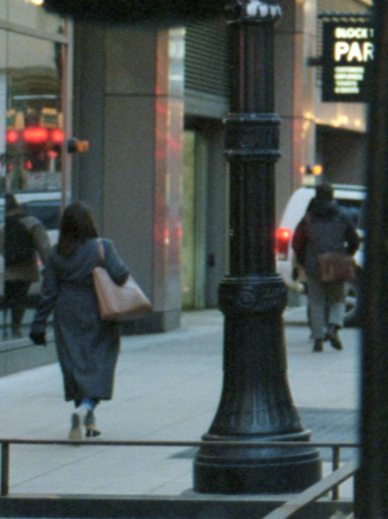
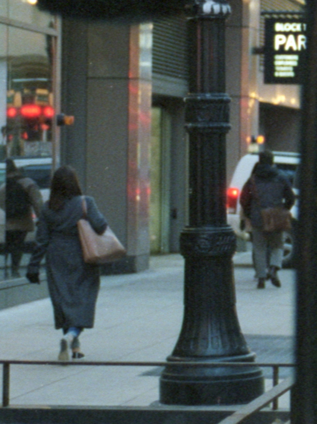
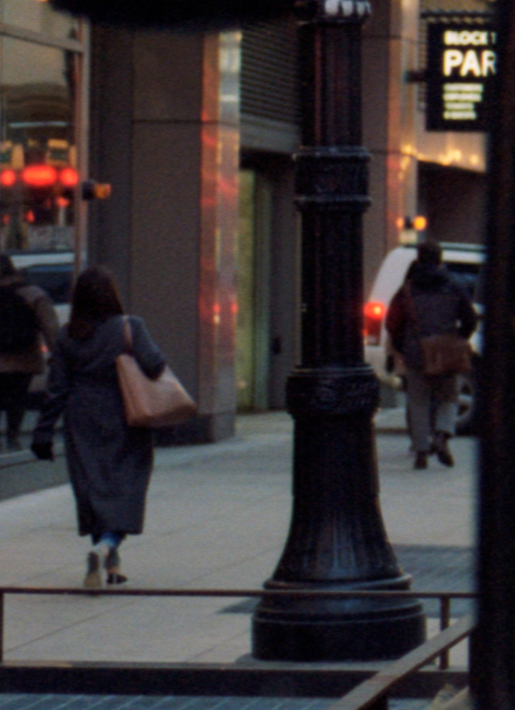
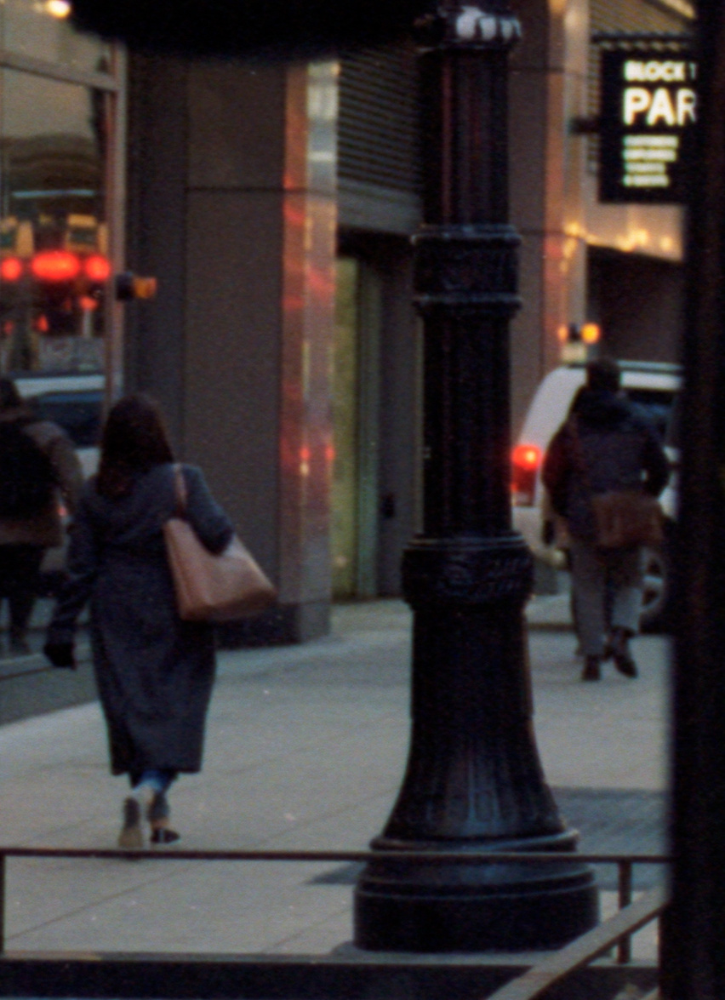
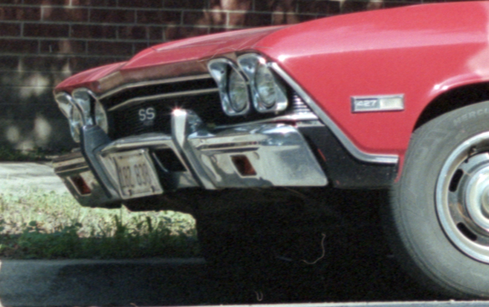
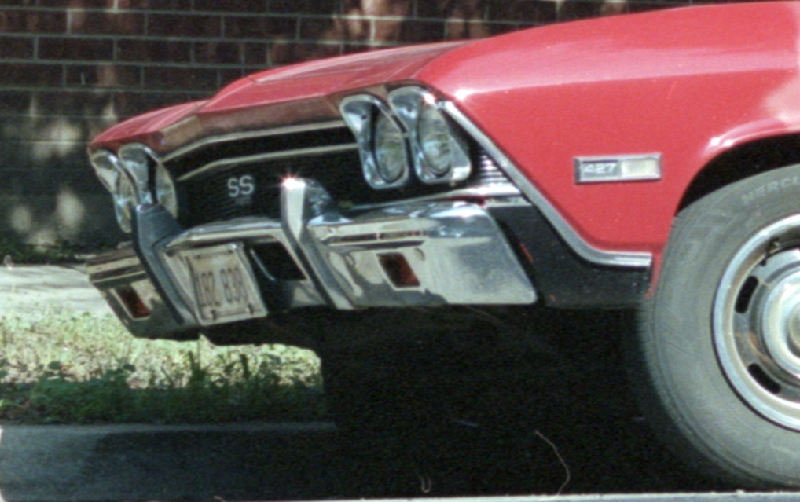
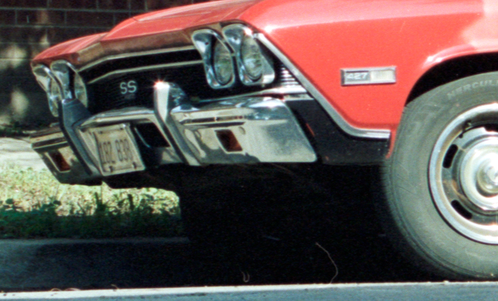
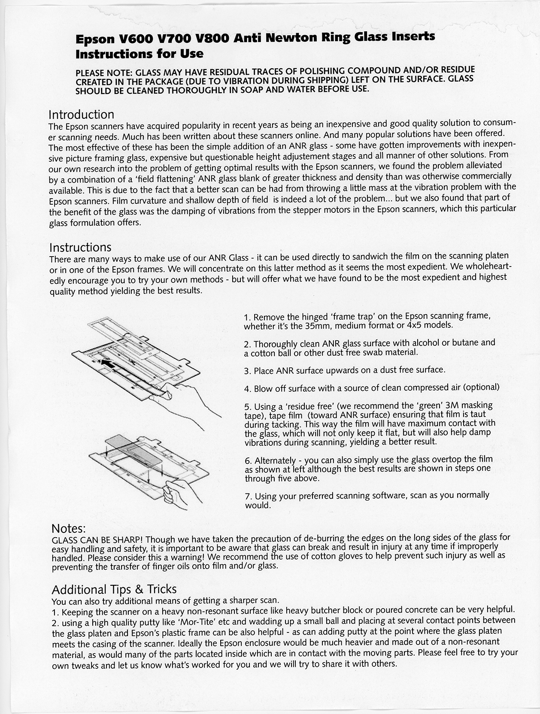

I picked up an anti newton ring (ANR) glass insert for my Epson v600 which fits into the stock plastic 35mm film holder. Some of my film becomes very curved and does not lay flat in the film holder. I did some research on ways to deal with this issue and some suggested buying new film holders and I also saw that you can get glass inserts for the stock film holder. I opted to get two ANR glass inserts since that was fairly cheap and the easiest method. Below I am going to go over the results from using the ANR glass inserts. 

## Setup

I chose three photos. I scanned using EPSON Scan and Silverfast 8. I don't have VueScan. 

EPSON Scan settings:
- Professional Mode
- Color Negative Film
- 2400 DPI
- Scale 100%
- Auto exposure
- Drag to edges of histogram
- Drag input to 0 and 255
- Unsharp mask off

Silverfast 8 settings:
- Photo Qualit 1 (300ppi) 300ppi
- Res. 3200ppi
- Negafix Kodak Porta 400 NC
- Unsharp Masking set to 0

These photos were shot on a Contax RTS with Carl Zeiss 50mm 1.7 T* Planar. I think the car one may have been shot on my Carl Zeiss VARIO-SONNAR T* (C/Y) 35-70mm; I do not remember. All of the shots were shot on porta 400 shot at box speed of ISO 400. Scanner is Epson v600. The ANR glass I got is from scantech.

## Comparison

I sampled three photos from my collection to rescan with and without the ANR insert. I cropped the three photos in regions that I thought would be good patches to determine if the ANR insert is useful or not. Looking at the overall photo is hard in this context; It makes more sense to dissect one patch to see the perceived improvements.

### First Photo - Downtown Chicago

#### EPSON Scan

Left image is without ANR insert. Right image is with ANR insert. The original image is 3335x2080 and it was scanned at 2400dpi. These are cropped at 100%.

With these sample images it is hard to discern whether or not it actually helps. The ANR insert does keep the film flat within the holder which is important.

#### Silverfast 8 

Left image is without ANR insert. Right image is with ANR insert. These are cropped at 100%.

Again I cannot tell that much of a difference.

### Second Photo - 606 Chicago

#### EPSON Scan

Top image is without ANR insert. Bottom image is with ANR insert.

The ANR insert seems to have better shadow detail and the edges of the leaves are a little bit more defined. It is subtle though.

#### Silverfast 8 

Top image is without ANR insert. Bottom image is with ANR insert.

Overall I would say the bottom image with ANR insert is better. The shadow and highlight detail is better with the ANR insert. Also the entire image looks sharper than the image without the ANR insert.

### Third Photo - Car 

#### EPSON Scan

Top image is without ANR insert. Bottom image is with ANR insert.

This is another good example. The ANR insert again helped the shadow detail in the grill of the car. Some of the lettering (427 on the side of the car) and the license plate is a bit sharper. Overall I would say the image is slightly sharper with the ANR insert.

#### Silverfast 8 

Top image is without ANR insert. Bottom image is with ANR insert.

I would make the same arugment from the EPSON Scan. Overall the ANR insert is a little bit sharper and has a little bit more detail.

## How to scan with the ANR glass inserts

These tips were packaged with my ANR glass inserts from scantech. I did clean my ANR inserts before using them. There was some debris on the glass itself. I haven't tried any of the other methods that they suggested. I only used them directly over the film within the stock Epson v600 filmholder.

*Espon V600 V700 V7800 Anti Newton Ring Glass Inserts Instructions for Use; from scantech*

`I used an image to text converter, please excuse any typos`

> Epson V600 V700 V800 Anti Newton Ring Glass Inserts Instructions for Use 
>
>PLEASE NOTE: GLASS MAY HAVE RESIDUAL TRACES OF POLISHING COMPOUND AND/OR RESIDUE CREATED IN THE PACKAGE (DUE TO VIBRATION DURING SHIPPING) LEFT ON THE SURFACE. GLASS SHOULD BE CLEANED THOROUGHLY IN SOAP AND WATER BEFORE USE. 
>
>Introduction 
>
The Epson scanners have acquired popularity in recent years as being an inexpensive and good quality solution to consum-er scanning needs. Much has been written about these scanners online. And many popular solutions have been offered. The most effective of these has been the simple addition of an ANR glass - some have gotten improvements with inexpen-sive picture framing glass, expensive but questionable height adjustement stages and all manner of other solutions. From our own research into the problem of getting optimal results with the Epson scanners, we found the problem alleviated by a combination of a 'field flattening' ANR glass blank of greater thickness and density than was otherwise commercially available. This is due to the fact that a better scan can be had from throwing a little mass at the vibration problem with the Epson scanners. Film curvature and shallow depth of field is indeed a lot of the problem... but we also found that part of the benefit of the glass was the damping of vibrations from the stepper motors in the Epson scanners, which this particular glass formulation offers. 
>
>Instructions 
>
There are many ways to make use of our ANR Glass - it can be used directly to sandwich the film on the scanning platen or in one of the Epson frames. We will concentrate on this latter method as it seems the most expedient. We wholeheart-edly encourage you to try your own methods - but will offer what we have found to be the most expedient and highest quality method yielding the best results. 
>
>1. Remove the hinged 'frame trap' on the Epson scanning frame, whether it's the 35mm, medium format or 4x5 models. 
>2. Thoroughly clean ANR glass surface with alcohol or butane and a cotton ball or other dust free swab material. 
>3. Place ANR surface upwards on a dust free surface. 
>4. Blow off surface with a source of clean compressed air (optional) 
>5. Using a 'residue free' (we recommend the 'green' 3M masking tape), tape film (toward ANR surface) ensuring that film is taut during tacking. This way the film will have maximum contact with the glass, which will not only keep it flat, but will also help damp vibrations during scanning, yielding a better result. 
>7. Alternately - you can also simply use the glass overtop the film as shown at left although the best results are shown in steps one through five above. 
>7. Using your preferred scanning software, scan as you normally would. 
>
>Notes:
>
>GLASS CAN BE SHARP! Though we have taken the precaution of de-burring the edges on the long sides of the glass for easy handling and safety, it is important to be aware that glass can break and result in injury at any time if improperly handled. Please consider this a warning! We recommend the use of cotton gloves to help prevent such injury as well as preventing the transfer of finger oils onto film and/or glass. 
>
>Additional Tips & Tricks
>
>You can also try additional means of getting a sharper scan. 
>1. Keeping the scanner on a heavy non-resonant surface like heavy butcher block or poured concrete can be very helpful. 
>2. using a high quality putty like 'Mor-Tite' etc and wadding up a small ball and placing at several contact points between the glass platen and Epson's plastic frame can be also helpful - as can adding putty at the point where the glass platen meets the casing of the scanner. Ideally the Epson enclosure would be much heavier and made out of a non-resonant material, as would many of the parts located inside which are in contact with the moving parts. Please feel free to try your own tweaks and let us know what's worked for you and we will try to share it with others. 

## Summary

Note: This is in the context of 35mm film, epson v600 scanner, and the stock epson v600 film holder. You may have a completely different setup and could get even better results depending on your setup.

I think the ANR glass insert does help the quality of the scans but not as much as you would think. I have only tested this with 35mm film with the stock Epson v600 filmholder. The main benefit I see from ANR glass inserts is to make sure the film lays flat within the holder. The small amount of detail that it gets is not anything to write home about. One drawback is that the glass accumulates dust. You can see on my scans with the ANR insert that there are more dust particles than without the insert. I did wash the ANR inserts before using them but I guess I was not careful enough when handling them.

I would get ANR inserts to see if it would help out your current setup. I am curious to see how much of an improvement it would be with medium format film and when used in wet mounting. My guess you would visually see a larger improvement in both of those methods. If you are expecting ANR inserts to give you more megapixels in your scan you are looking in the wrong place. The ANR insert acts like a dial that you can tweak to edge out a little bit more detail and sharpness within the scan itself. 