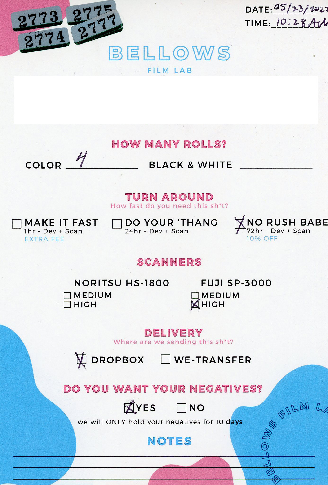
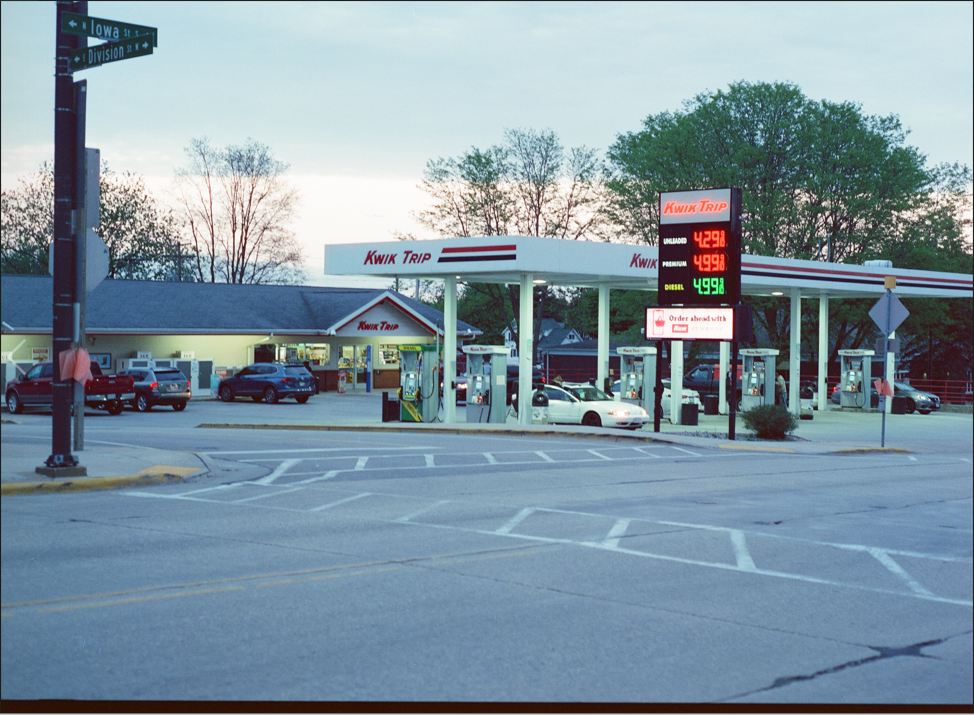

>Bellows Film Lab Chicago @ 1702 N Damen Ave, Chicago, IL 60647

A new Chicago film lab opened up in Wicker Park called Bellows Film Lab. They originally
opened a location in Miami. Block Club Chicago wrote a piece on them [here](https://blockclubchicago.org/2022/05/20/with-bellows-film-lab-a-lifelong-photography-lover-brings-quick-turnaround-film-development-to-wicker-park/)

I came back from a climbing trip and decided to try them out since they had their grand
opening the weekend I was out of town. I dropped of 4 rolls of C-41 120.

## tl;dr
I will not be returning to Bellows Film Lab Chicago. I do not recommend anyone to use their services.

- Did not recieve my scans and negatives for 2 weeks after I dropped them off due to misspelled email address
- They sent my scans 2 weeks later missing an entire roll and 5 frames of another roll.
- Some of the folders have garbage scans from a bad scan, these were not filtered out (Not the first, last, or blank frames. Bad scans along side a legimate scan.)
- Several of my scans were physically cropped do to misalignment in the scanner. (7/15 on one roll & 4/15 on another)
- Absolutely no quality control across the entire customer experience
- The worst part is the scans that were aggressively cropped due to a misalignment were on the 2 rolls of film they originally forgot to scan. So after failing to realize they did not scan my original rolls, they proceeded to botch the rolls when they scanned them and did not check for quality control again!

## Costs

C-41 120 is $12 a roll to develop. Scanning is $15 a roll for "H" which is high resolution. A total of $108 without 10% discount and tax applied.

## Experience

Sent my film in on a Monday and used the 72 hour no rush option which gives 10% off your order. 

I called them two weeks later on a Monday asking them about the status of my order. They told me that
it was completed 1 day after I dropped of my order. Turns out they spelled my email wrong when sending me
the dropbox link. 

They immeditately sent me a link to my scans on dropbox. I open them up and find that I only have 40 out of my 60 scans. I shot 4 rolls on my Mamiya 645. 

I walked back to the shop to inform them that they missed scanning an entire roll of film and 5 shots off another roll. They said they would expedite the process and get them scanned by the end of the day. They did return me the scans at 
the end of the day.

They called me later that day recommending me to use the Noritsu HS-1800 due to the image quality and the scans will be returned faster. I ordered Fuji SP-3000, I don't exactly know why they needed to call me to convince me to use a different scanner. I agreed to resolve this issue faster.

## Scans

There is absolutely no quality control. Frames were phyiscally cropped way too much.

The folder structure for the images was just one large folder with the images numerically labelled. Atleast every 15 images
belonged to the same roll. Remember how they completely forgot to scan 2 rolls of film? Well after they corrected this the two rolls of film have aggressive cropping on them even after they forgot to scan them! 

- Roll 1, 7/15 frames aggressively cropped 
- Roll 2, 4/15 frames aggressively cropped

Here is an example shot,

*Note: I took a screenshot of the image on my desktop. The only cropping issue is the large black area on the bottom of the frame*

## Issues summarized 

- Did not recieve my scans and negatives for 2 weeks after I dropped them off due to misspelled email address
- They sent my scans 2 weeks later missing an entire roll and 5 frames of another roll.
- Some of the folders have garbage scans from a bad scan, these were not filtered out (Not the first, last, or blank frames. Bad scans along side a legimate scan.)
- Several of my scans were physically cropped do to misalignment in the scanner. (7/15 on one roll & 4/15 on another)
- Absolutely no quality control across the entire customer experience
- The worst part is the scans that were aggressively cropped due to a misalignment were on the 2 rolls of film they originally forgot to scan. So after failing to realize they did not scan my original rolls, they proceeded to botch the rolls when they scanned them and did not check for quality control again!

## All in all

I will not be returning to Bellows Film Lab Chicago. I do not recommend anyone to use their services. If you are in Chicago I recommend using CSW Film Systems.

If you are outside Chicago and are mailing your film, there are plently of other labs across the country that develop and scan film.
You are not missing out on much using Bellow's services.

If you need to buy film in Chicago I recommend Dodd Camera on Armitage.

## Comparision to The Darkroom

- Mails you your negatives back (hand checks them as well with signed cards for proof)
- Will not throw your negatives out after 10 days (*Order form above from Bellows has print saying they only hold them for 10 days*)
- Properly labels each set of scans within their repective folders from the id on the roll of film
- Contact sheet to further check everything is scanned properly
- Bellows is $27 a roll ($12 development + $15 high resolution scans) vs The Darkroom $20 ($12 + $8 super scans)

## Google Reviews of their Miami location

After experiening these issues I wanted to see if others had a similar time. Since the Chicago location recently opened, there are not many reviews.

I checked their Miami location and sorted by lowest and found too many similar situations.

>[Original review](https://g.co/kgs/hzuWGd): Isabella Bejarano 
>~2021
>
> Critical: Professionalism, Quality
>
>I now understand the various negative reviews. Let me start by saying i'm a professional photographer and I'm used to professional labs in NY. This is not a pro lab by any means. I took a chance by bringing 2 rolls (with a job on them) and I was very disappointed by everything that happened next. To start, my scans were not delivered on time. I called in after 5 days and I quickly realized something was wrong when they didn't know what happened. I went in person and the deer in headlight who was looking for my negatives at one point said he thought they might have tossed them! Can you imagine a lab that would toss your negs 5 days? Negs were finally found after a while, but surprise...they had not been scanned. I was promised they'd be scanned by that evening, of course they were not. I received an email the next day, but it only included the digital contact sheets, not the actual picture files. I had to call again and wait again for my scans. Also, the contact sheet was a joke--2 rolls of film all mixed up, not in order--the files were named the same for both rolls, how did no one notice this? And the scanned files were either manipulated at their desire (super saturated and contrasty) or the developing was screwed up. Sure, they refunded me for developing and scanning but I lost a work week waiting, nearly lost a job on film and now need to get them scanned by a pro lab to see what's up. Basically, this is a consumer lab for people looking to develop film that isn't important. Pro shooters go elsewhere! Palm Lab in South Miami has been the best lab so far for me in town, very quick and clean negs and scans.
UPDATE: I took the Portra film (a very common type of film) Bellows developed for me to a PRO lab and they confirmed that Bellows either didn't use the correct chemistry for my film or overdeveloped it. This means it's RUINED, the colors are oversaturated, shadows are blocked up and highlights are blown out. Oh and my negs have dents and scratches! Do not believe the positive reviews--what a JOKE of a lab. I know for a fact many others have had similar experiences.

> [Original review](https://g.co/kgs/LqKGBF): Julieta P
>~2021
>
>Critical: Professionalism, Quality, Value
>Everything wrong with this place:
>
>1. They didn’t develop within the time promised (Sent pictures in 5 days instead of 72hours).
>2. Sent through Dropbox instead of WeTransfer, as initially requested.
>3. SENT FILM FROM TWO DIFFERENT PEOPLE TWICE (Huge breach of privacy).
>4. After many tries, finally received my film poorly scanned (full of dust, broken film and AWFUL quality overall).
>5. Was missing MULTIPLE pictures.
>6. Unprofessional and disorganized.
>7. Right after giving a negative review to their services, their Instagram account sent a message mocking me (screenshot attached).

> [Original review](https://g.co/kgs/ZU1com): Lucia Prado
>5 months ago
>
>Critical: Professionalism, Quality, Responsiveness, Value
>
>Gosh, where to start. What an awful experience. I decided to have a film developed here as it’s closer to me than other film labs and I followed them on Instagram and they seemed to know what they were doing with the quality of photos. But, it’s probably an Instagram vs reality situation and reality is the key. Walked in to the shop, it’s decorated well, with lots of funky pieces and fully stocked. The shop had a smell like portable potty, not sure where that was coming from. The employee was okay, he helped me take out my film from my new camera. I filled out the form with “no rush” that was supposed to be ready in 72 hours. After 72 hours, I had not yet received my scanned photos via email. I called the shop and they said there had been “some mix up” not sure what this mix up was as this was as straightforward as it gets. A few hours later I had not yet received my photos so I tried calling again and no answer. I called a few times- no answer. I check my email and they had just sent my photos.
>
I was missing about 6 photos from a 24 roll. I know depending on certain photos this can happen if they’re too dark etc. Every single photo had a Scribble line on the top of the photo. Meaning they had not scanned them well probably in a rush. Their margin was off, and it came out in every photo. I called the next morning to inform them of this. They said they’d call me in a few minutes. A few hours passed and I called again. They said they were busy and would be rescanning the photos by the end of the day. They said that the 8 missing photos were not missing but actually too dark to scan. I thought alright that’s fine. It happens.
>
I finally get to checking out their new scan and every single photo has a squiggly line on the corner and guess what? Two new photos appear! Photos that were not in the first scan. I pick up my negatives and guess what? Another photo is in my negatives that was not scanned. What a waste of money and time. I don’t think these folks know what they’re doing. They misplace your things in a mix up, then scan them rushed and mess up margins and leave things in the scanners that ruin your photos. Definitely never coming here again. There are other film labs in Miami that focus more on the quality and knowledge behind film versus their shop aesthetic. My partner also had a bad experience with them as we both took films to be developed. Don’t come here if you really care about quality and a job well done.