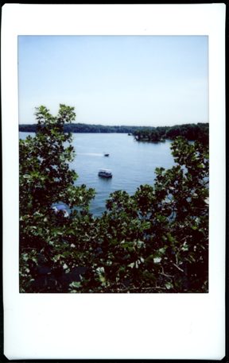
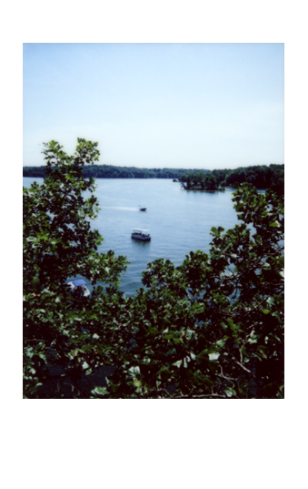

I recently have been scanning my fuji instax mini film on my Espon V600. When scanning the instant film I usually scan a larger region to have a buffer around the film. This is to make sure I am always scanning the entire image. This allows me to use the original instax border or to crop the image to my liking instead of cropping it during the scanning phase.




After scanning the image I would bring it into Lightroom to straighten and crop. 


I could use the image as is but I thought it would look better to bring back the instax mini film border. Instead of tediously computing the ratios for the border each time for any image I wrote a photoshop javascript script to automatically change the canvas size.

```javascript
var doc = app.activeDocument;

// Compute instax ratios for perfect white border in inches
var topMarginPercent = 0.29/2.44;
var sideMarginPercent = 0.16/1.81;
var bottomMarginPercent = 0.62/2.44;

var docHeight = doc.height;
var docWidth = doc.width;

var sideMargin = (2.0 * sideMarginPercent * docWidth);
var bottomMargin = docHeight * bottomMarginPercent;
var topMargin = docHeight * topMarginPercent + bottomMargin;

doc.resizeCanvas(null,UnitValue(bottomMargin + docHeight,"in"),AnchorPosition.TOPCENTER);
doc.resizeCanvas(UnitValue(sideMargin + docWidth,"in"), null, AnchorPosition.MIDDLECENTER);
doc.resizeCanvas(null,UnitValue(topMargin + docHeight,"in"),AnchorPosition.BOTTOMCENTER);

// Set the background to white after extending the canvas size
// it would be black otherwise
var white = new SolidColor();
white.rgb.red = 255;
white.rgb.green = 255;
white.rgb.blue = 255;
doc.backgroundColor = white;
```

You can save this as a javascript file for you can import it into photoshop. After saving the file you can open it in photoshop by going to File -> Scripts -> Browse... and load the javascript file. This border will be applied to the entire document. Make sure you only have the image loaded and the document is the size of the image.

