I recently got my scans back from [The Darkroom](https://thedarkroom.com/) and I wanted to compare them to my new Pacific Image Prime Film XAs super edition scanner. I ordered the super scans from The Darkroom to compare to my scanner which has an effective resolution of 4300 DPI. I scanned all my film at a DPI of 5000 for these tests. The films I recieved from The Darkoom scans are 4492x6774 72 DPI 87.1MB ([super scan reference](https://thedarkroom.com/scans/)). Their site also has example scans if you wanted to check out their scan quality. 

Another comparison I wanted to see with this test was the comparsion between two of my lens. I used the Carl Zeiss Planar T* (c/y) 50mm 1.7 and Carl Zeiss Vario Sonnar T* (c/y) 35-70mm 3.5. I wanted to compare the two different lenses; I shot the Vario Sonnar at 50mm.

I shot 6 images around Chicago. I am going to upload the original scans from The Darkroom since they are around ~26MB each. I will have to downsize my own scans because since they are large TIFFs at about ~190MB. 

I scanned each one of my images in Silverfast 8 SE. I scanned them as positive DNG files to convert in NLP. The NLP settings I use were Color Model: Frontier, Tones: Standard, everything else is untouched expect Film color on Kodak. The film used was Kodak Gold 200 shot at box speed. I added no sharpening and I did not scan with any sharpening. I will add some sharpening in another section. 

In photoshop I scaled my images down to 6774px in width and then added both my image and The Darkroom's image as separate layers. I used the Edit -> Auto-Align layers... -> Auto to align both images on top of one another. The zoom percent is 100% on all the cropped images. The full images for each of the scenes is provided at the bottom of the page.

### 1. Carl Zeiss Vario Sonnar T* (c/y) 35-70mm // Gold 200

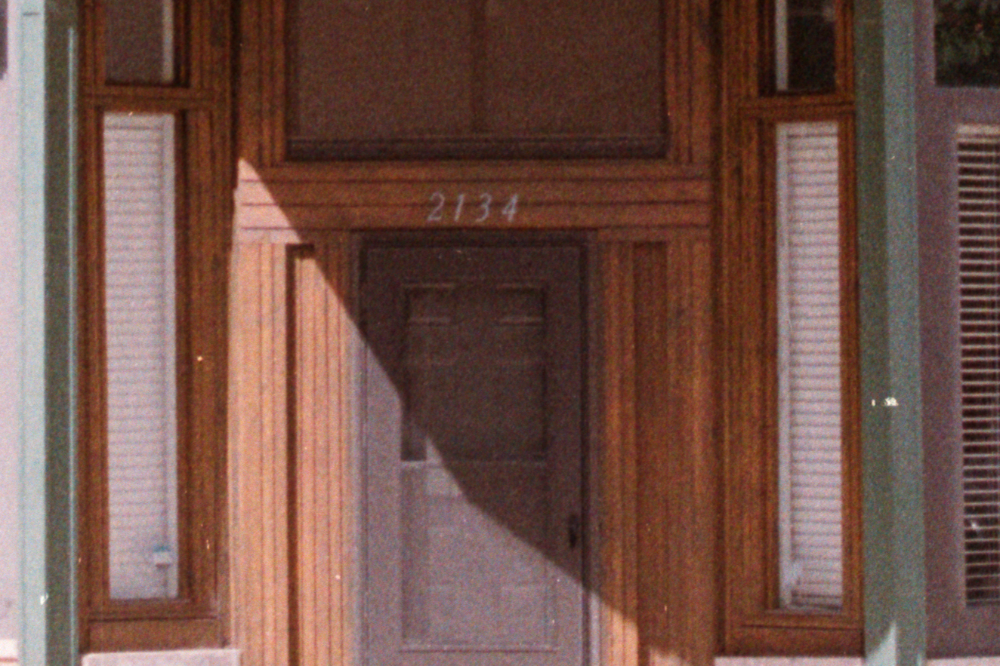
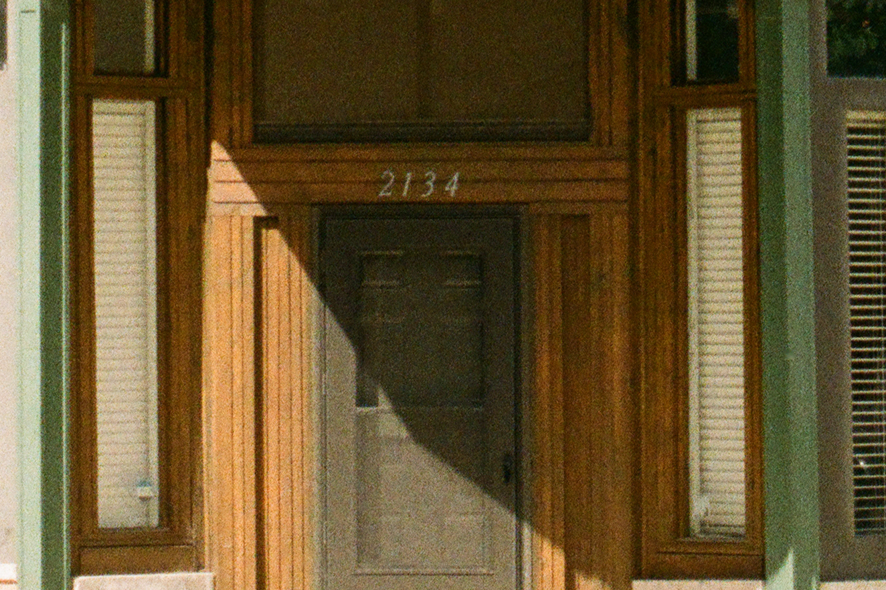

<i style="text-align: center;">

Top is XAs (no shaperning) // Bottom is The Darkroom

</i>

### 2. Carl Zeiss Planar  T* (c/y) 50mm 1.7 // Gold 200

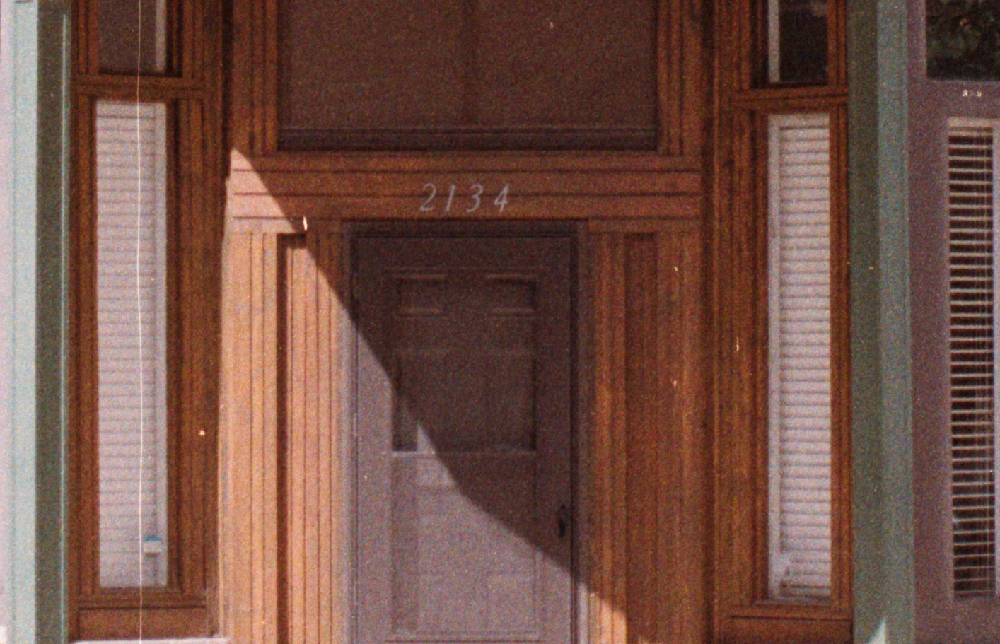
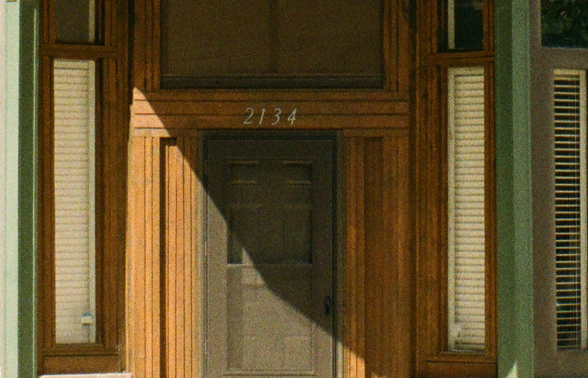

<i style="text-align: center;">

Top is XAs (no shaperning) // Bottom is The Darkroom

</i>

### 3. Carl Zeiss Planar T* (c/y) 50mm 1.7 // Gold 200

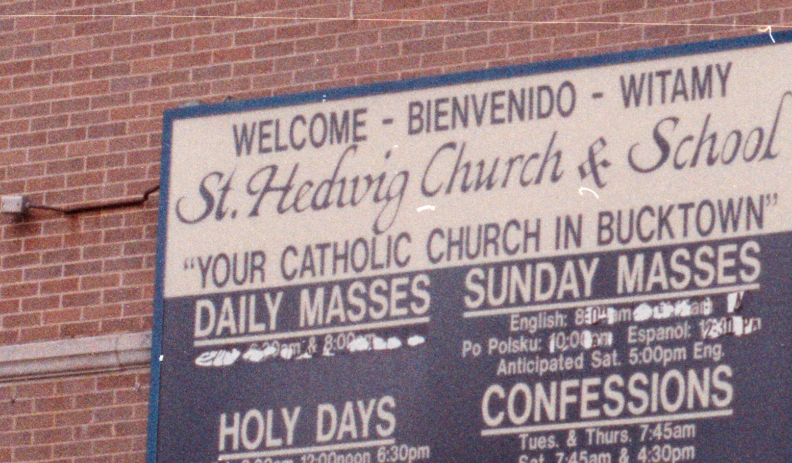
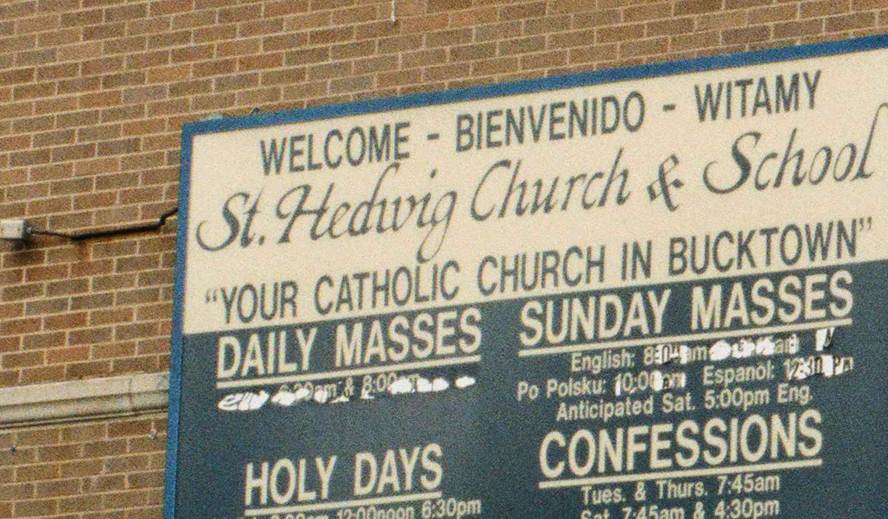

<i style="text-align: center;">

Top is XAs (no shaperning) // Bottom is The Darkroom

</i>

### 4. Carl Zeiss Vario Sonnar T* (c/y) 35-70mm // Gold 200

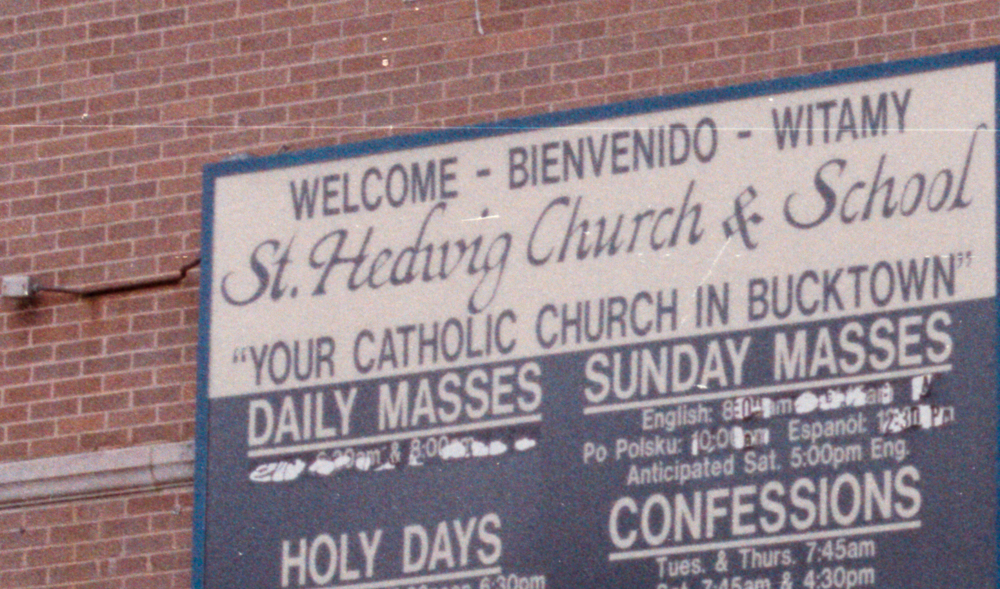
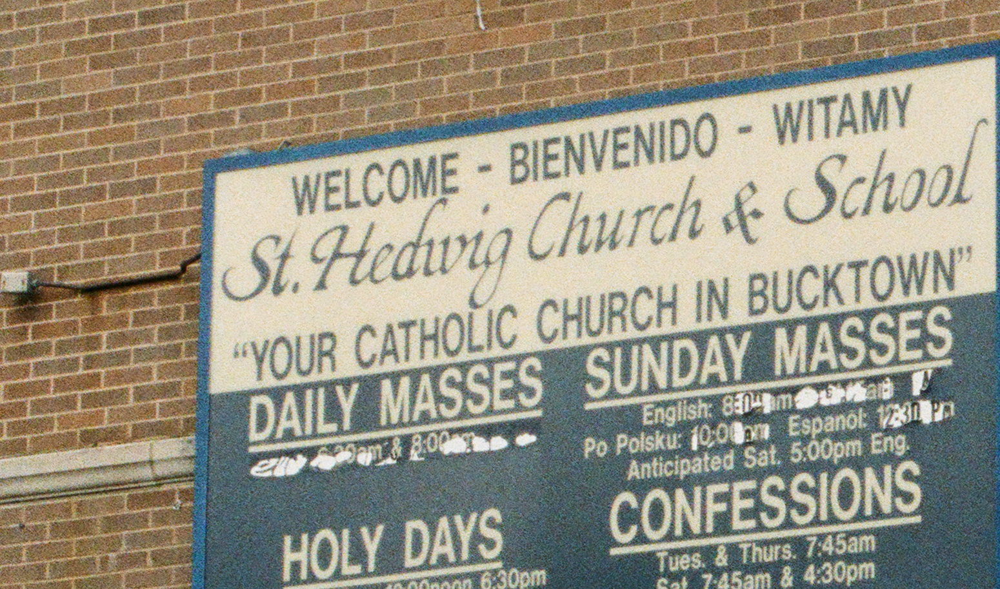

<i style="text-align: center;">

Top is XAs (no shaperning) // Bottom is The Darkroom

</i>

### 5. Carl Zeiss Vario Sonnar T* (c/y) 35-70mm // Gold 200

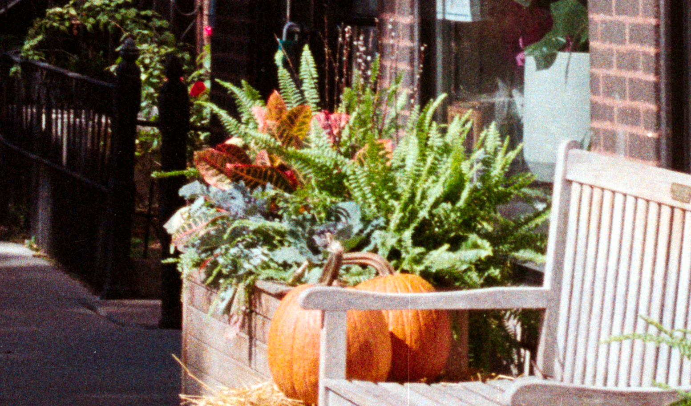
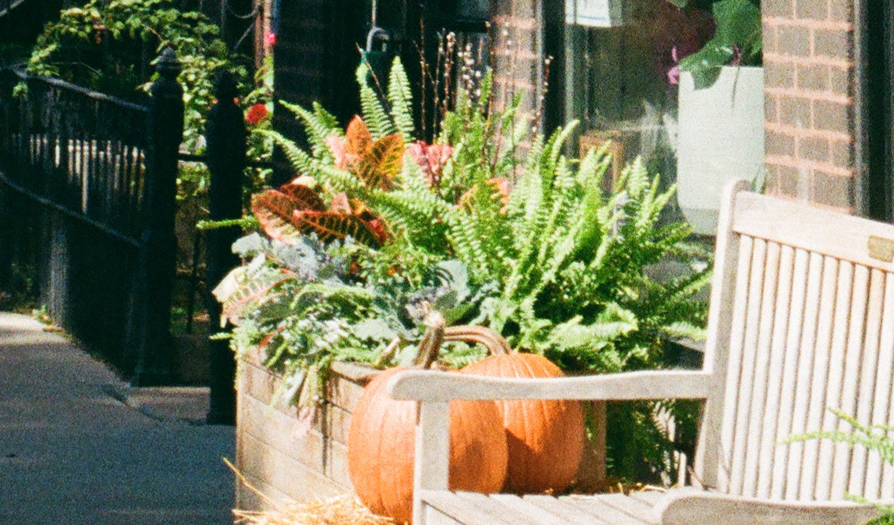

### 6. Carl Zeiss Planar T* (c/y) 50mm 1.7 // Gold 200

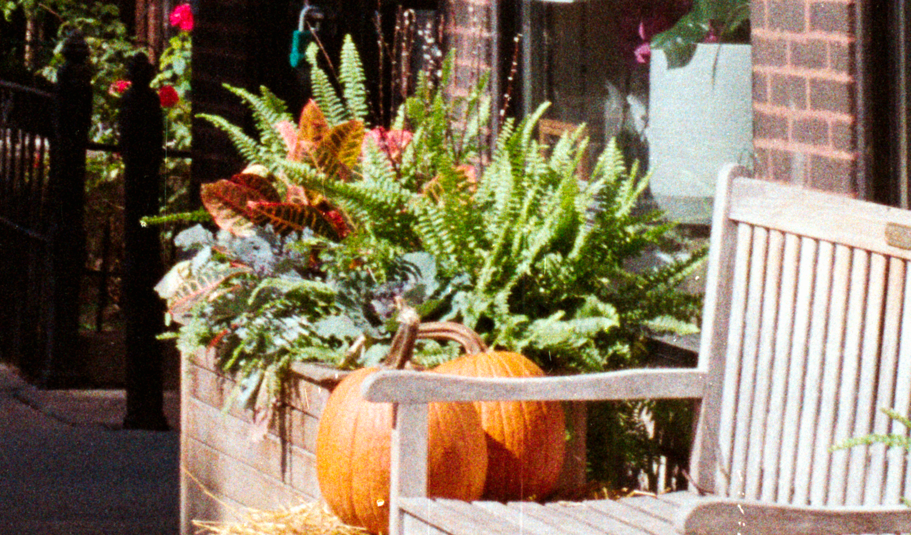
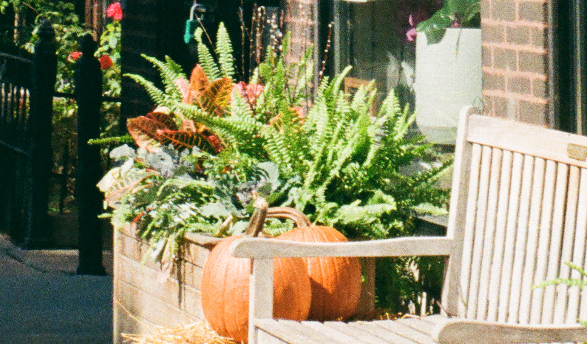

<i style="text-align: center;">

Top is XAs (no shaperning) // Bottom is The Darkroom

</i>

## One sharpening test

### 1. Carl Zeiss Vario Sonnar T* (c/y) 35-70mm // Gold 200

In this example I oversharpened my scan to compare the quality to The Darkroom scan. I am quite surprised by the resolution of the XAs scanner. My scan does have more noise and grain due to sharpening the image in post instead of having a higher quality scanner. This isn't that big of an issue because the results are still amazing. I think this is a good example of the resolution that the scanner can resolve. The next test I should do is try to see how I can match the colors of the lab scanners. I am not too worried about this because I do not fuss over the colors that much.

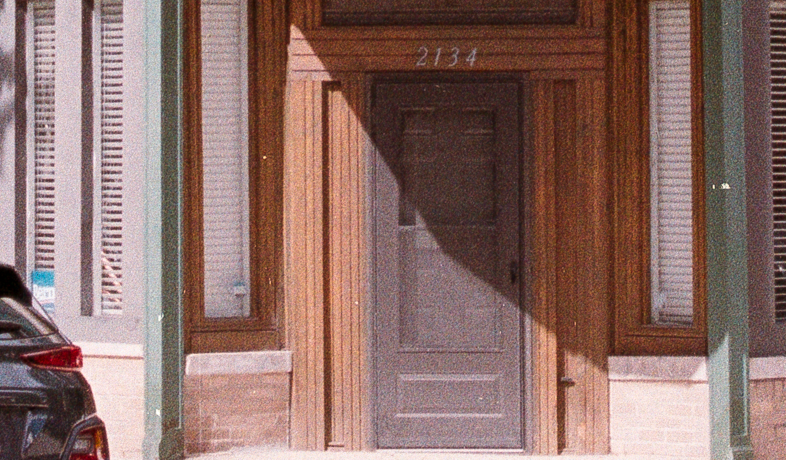
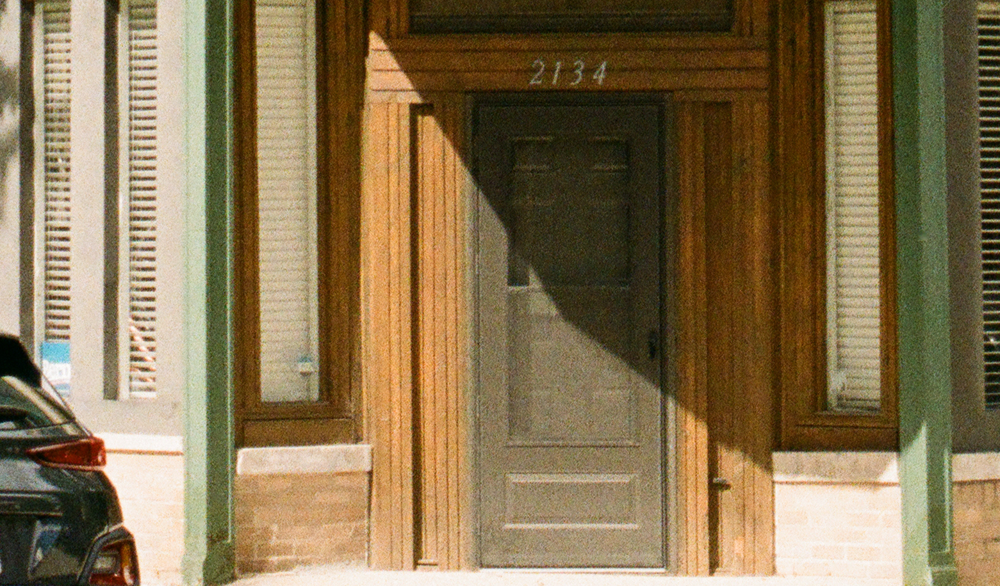

<i style="text-align: center;">

Top is XAs; Added sharpening in Lightroom // Bottom is The Darkroom

</i>

## Fully quality scans from The Darkroom of images 1, 3, and 5

## Summary

Overall I am pleased with the resolution that the Pacific Image Prime Film XAs super edition scanner can provide. For a cheap at home scanner this produces great results. I think with enough effort you can get the color of your scans to your liking as well. The quality of the scans from The Darkroom are perfect. The images are always free of noise and artifacts. The color across the entire roll of film is consistent. You cannot go wrong with using The Darkroom to development and scan your film. 
