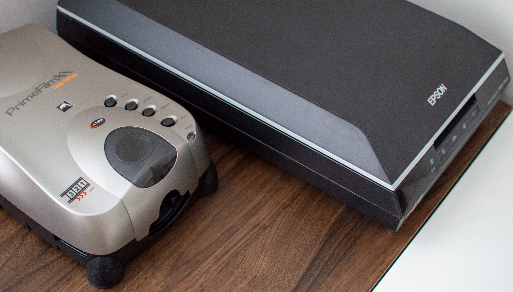
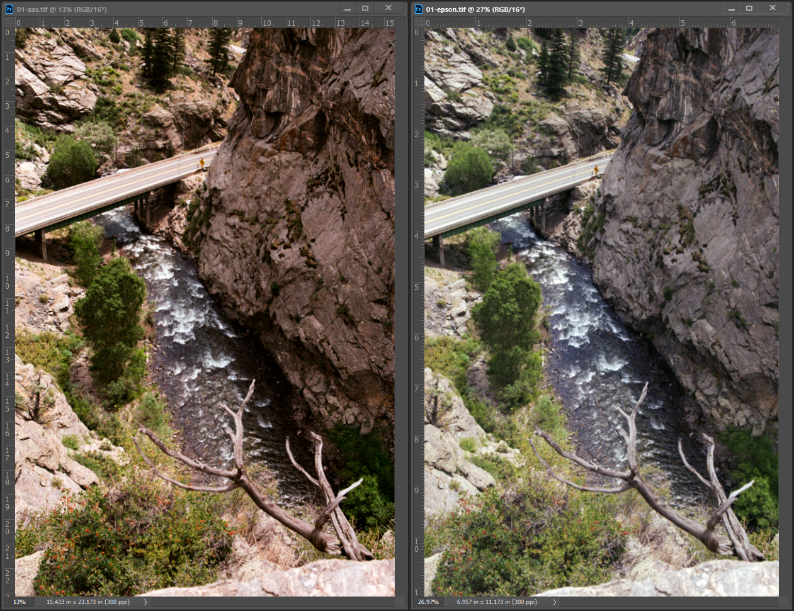
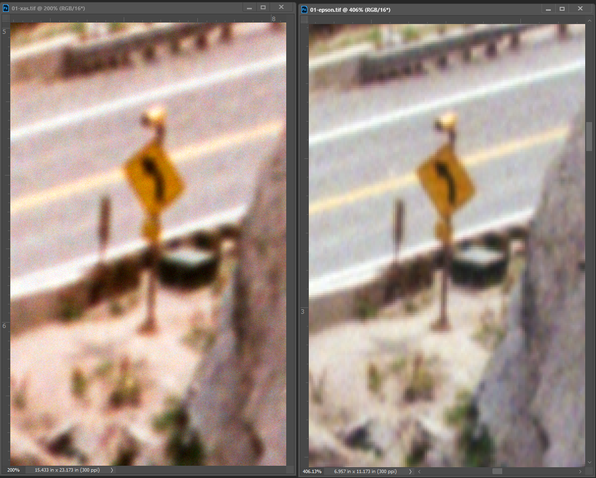
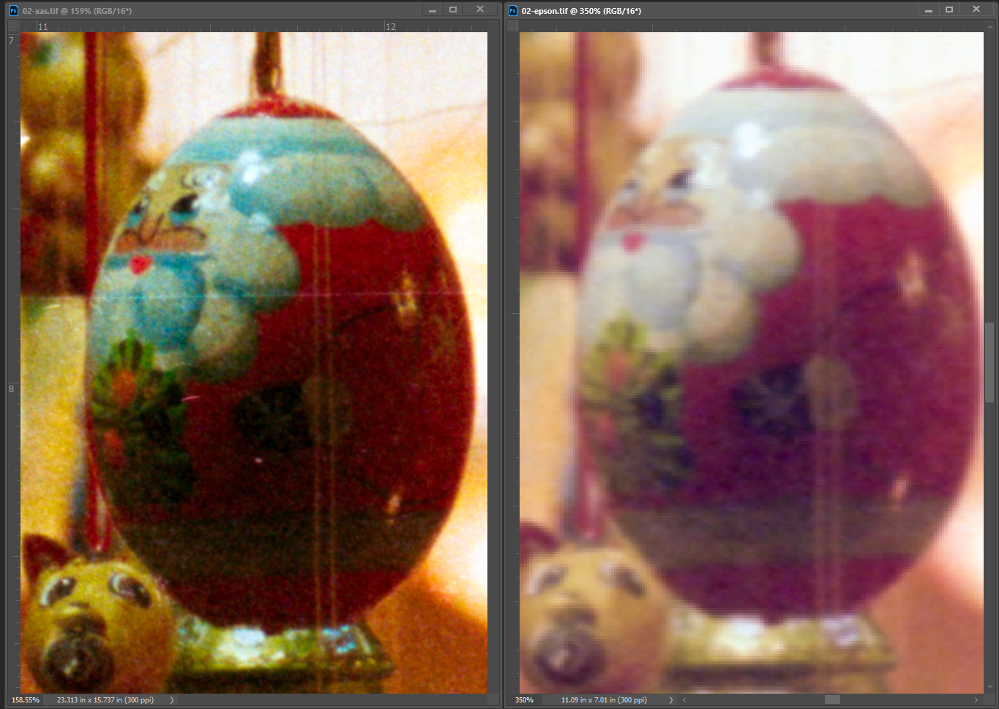

<i style="text-align: center;">

XAs on the left. v600 on the right.

</i>

The Pacific Image Prime Film XAs super edition scanner is one if not the best at home scanner in terms of DPI for 35mm negatives.

I have been scanning 35mm film at home on a v600 and I have been wanting more resolution at home. After a lot of research I finally settled
on the Prime Film XAs. Here is a chart of scanners taken from [/r/analog](https://www.reddit.com/r/analog/wiki/scanning). It was originally generated from [filmscanner.info](https://filmscanner.info/en/).

Scanner |Type |Price New (USD) |Aprx. Price Used (USD) |Advertised (dpi) |Actual (dpi) |35mm |120 |4x5 |8x10
-|-|-|-|-|-|-|-|-|-
Braun FS-120 |Dedicated |$2000 |N/A |3200 |3270 |Y |Y |N |N
Canon CanoScan 9000F |Flatbed |N/A |$140 |9600 |1700 |Y |Y |N |N
Canon CanoScan 9000F MK II |Flatbed |$170 |$140 |9600 |1700 |Y |Y |N |N
Epson Perfection v500 |Flatbed |N/A |$100 |6400 |1250** |Y |Y |N |N
Epson Perfection v550 |Flatbed |$200 |$180 |6400 |1560 |Y |Y |N |N
Epson Perfection v600 |Flatbed |$230 |$200 |6400 |1560 |Y |Y |N |N
Epson Perfection v750 |Flatbed |N/A |$475 |6400 |2300 |Y |Y |Y |Y
Epson Perfection v800 |Flatbed |$675 |$700 |6400 |2300 |Y |Y |Y |Y
Epson Expression 10000 XL |Flatbed |$1000 |N/A |2400 |2170 |Y |Y |Y |Y
Epson Expression 11000 XL Pro |Flatbed |$2459 |N/A |2400 |2170 |Y |Y |Y |Y
HP Scanjet G4050 |Flatbed |N/A |N/A |9600 |1300 |Y |Y |Y |Y
Nikon Coolscan V |Dedicated |N/A |N/A |5000 |3650 |Y |N |N |N
Nikon Super Coolscan 5000 ED |Dedicated |N/A |N/A |5000 |3900 |Y |N |N |N
Nikon Super Coolscan 9000 ED |Dedicated |N/A |N/A |4000 |3900 |Y |Y |N |N
Plustek OpticFilm 8200 |Dedicated |$370 |N/A |7200 |3250 |Y |N |N |N
Plustek OpticFilm 120 |Dedicated |$1900 |N/A |5300 |3450 (*4598) |Y |Y |N |N
Pacific Image PrimeFilm 7200 (EUR: Reflecta CrystalScan 7200) |Dedicated |$179 |N/A |7200 |3300 |Y |N |N |N
Pacific Image PrimeFilm XE (EUR: Reflecta ProScan 10T) |Dedicated |$329 |N/A |10000 |4100 |Y |N |N |N
Pacific Image PrimeFilm XA (EUR: Reflecta RPS 10M) |Dedicated |$399 |N/A |10000 |4300 |Y |N |N |N
Pacific Image PF120 (EUR: Reflecta MF5000) |Dedicated |$1299 |N/A |3200 |3050 |Y |Y |N |N

From this list of devices that filmscanner has tested it is the 2nd highest DPI. This is excluding lab scanners because not everyone has the means to get a lab scanner at home. 

## Workflow

I am using this scanner with Silverfast 8.8 SE. Mine came with a copy of it when I purchased it from bhphoto. I recommend either using Silverfast or Vuescan with this scanner. The scanner and software both support batch scans. I usually cut film into 5 frames and this works well with the scanner. They have advertised that you can automatically scan an entire 36 frame roll but I have not tried that yet. I would be somewhat skeptical because the scanner does not perfectly align the frame within the scanning region at times. Overall I have really enjoy scanning with this scanner and cannot wait to scan more. Here is my typical workflow. 

Load the film into the scanner. Position the film with the forward and backwards button to perfectly align the frame within the scanning region. In Silverfast I setup negaxfix for my film stock and I scan at 5000 DPI.

If I use Silverfast to scan the film as a positive for a DNG file to convert within Negative Lab Pro (NLP) i'll crop the side of the frame with the scanner to make sure I get some of the border. One downside with scanning for NLP is that you lose dimension because the scanning region perfectly fits the 35mm frame. It isn't that big of an issue but sometimes you will lose a bit of your frame for the border. 

## Output

When scanning the negative as TIFF or DNG at 5000 DPI you will see an image around 150-200MBs. This isn't that bad. 

## Comparisons (pixel peeping)

The left image will always be the Pacific Image Prime Film XAs super edition and the right image is the v600.

You can see the zoom percent in each photo as well as the size in inches and the DPI. Each photo is directly from the scanner. There is no added sharpening. Scanned without sharpening as well. I scanned the photos using Silverfast to DNG then converted with NLP.

<i style="text-align: center;">

Zooming all the way into the road sign.

</i>

<i style="text-align: center;">

Zooming into the center of the image, the santa is directly in the center of the frame.

</i>

The results are amazing. The amount of detail and color blows the v600 out of the water. Adding sharpening for sharing and printing makes these images even better.

## Results

Exported original TIFF scans as PNG. There is no sharpening added in these photos. Scanned without sharpening as well. I scanned the photos using Silverfast to DNG then converted with NLP.

<i style="text-align: center;">

Contax RTS // Carl Zeiss Planar T* 50mm 1.7 // Porta 400

6965x4720 -> 3500x3500

</i>

<i style="text-align: center;">

Contax RTS // Carl Zeiss Planar T* 50mm 1.7 // Porta 400

6991x4733 -> 4001x2710

</i>

<i style="text-align: center;">

Contax RTS // Carl Zeiss Vario Sonnar T* (c/y) 35-70mm // Porta 400

6919x4696 -> 4000x2716

</i>

<i style="text-align: center;">

Contax RTS // Carl Zeiss Vario Sonnar T* (c/y) 35-70mm // Gold 200

7045x4684 -> 3750x2494

</i>

## Why I bought one

I wanted to get as high of a resolution scan at home so I can get film developed at the lab without scans. This saves costs so I can shoot even more film. I have enjoyed controlling the scanning process. Usually I will scan my film on the v600 to get a contact sheet and for web sharing. If I want to print or share a high resolution image I will scan only a few frames from the original roll to save time. I usually don't need the entire roll to be scanned at a high resolution. This allows me to pick and choose what frames I want scanned at high resolution for I am not sitting for hours rescanning all of my film. The DPI increase from 1560 to 4300 is amazing. I will be able to print large sizes now. 

## Is it worth buying one?

I would say yes, it is worth buying one. I paid $499 without shipping and tax at the time of this post. I was easily able to setup the scanner on Windows 10 with Silverfast SE (I don't have Vuescan). The results of the 4300 DPI scans are out of the world. It blows v600 out of the water for 35mm scans. This scanner will be slower than most flatbeds and DLSR/mirrorless scanning. I would use this scanner for specific images instead of an entire roll to save time. The button interface on the scanner has been pleasant to use. You can easily load and eject film from the scanner. Aligning the frames within the scanning region is also very easy. Overall I am pleased with my purchase and cannot wait to scan more film.

## Other resources for the Pacific Image Prime Film XAs super edition

Youtube video : 
[A Modern Day Pakon Film Scanner - Pacific image primefilm XAs super - Shootswithcoops](https://www.youtube.com/watch?v=LLuyGeYJPX4)

Blog post : 
[Pacific Image XA Review – I Scan at home, and this is why – Guest Post by Mark Sperry March 15, 2017](https://www.35mmc.com/15/03/2017/pacific-image-xa/)