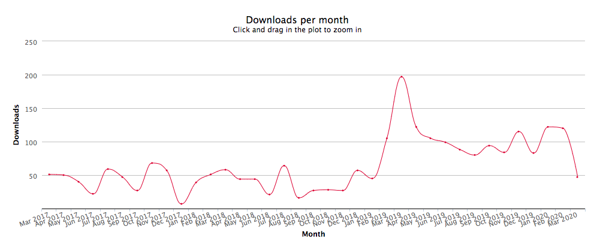
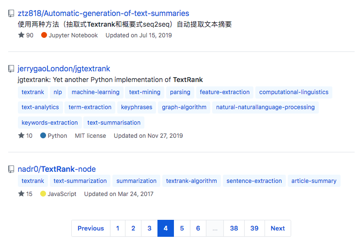

To whoever is reading this I hope all is well. Stay home and stay healthy.

---

For a class CS 410 at UIUC back in spring of 2017 I wrote an application with classmates to aggregate news sources on the same topic and then summarize the articles into a new article. The main idea was if N news sources all wrote the same article you could just read a summarized version of those N sources. One component of the system was the automatic text summarization feature. I found some random pearl? library to do this for us. I was interested on how this actually works so on spring break that year I looked up this paper [TextRank: Bringing Order into Texts](https://web.eecs.umich.edu/~mihalcea/papers/mihalcea.emnlp04.pdf) and decided to implement a javascript library for some of the main features in this paper.

I created two open source repositories one for [Vanilla JS](https://github.com/nadr0/TextRank) and one for [node.js/npm](https://github.com/nadr0/TextRank-node)

### I achieved a few goals with this project

1. Finding an academic paper and implementing some of its findings
2. Create an open source library
3. Publish the library to NPM
4. Support vanilla JS and node.js in the most basic way.

### How the package has performed over the past few years

Three years after creating this package it is cool seeing all the downloads and how people have used the repositories thanks to npm statistics and github repository statistics. 

Let's take a look at [TextRank-node](https://github.com/nadr0/TextRank-node)

- Stars - [https://github.com/nadr0/TextRank-node/stargazer](https://github.com/nadr0/TextRank-node/stargazers)s

As of writing this post my package has a total of 15 stars!

- Downloads - [https://npm-stat.com/charts.html?package=textrank&from=2017-03-26&to=2020-03-26](https://npm-stat.com/charts.html?package=textrank&from=2017-03-26&to=2020-03-26)

I have a total of 2,410 downloads which probably a lot of them are due to bots or package listing websites that just download all packages. 

Overall it is cool to see all the downloads that have taken place over time. It is hard to tell but probably all the valleys are the actual amount of downloads instead of the highs due to the amount of auto downloads or bots who download packages.

- Github search

while not logged into my account I searched textrank in the search bar and here are the results.

I see my package on the bottom of the fourth page!

I made this post to reflect on a package I wrote three years ago and it is cool to see how far it is come. It isn't a massively used package but I like I wrote a package and others can use for side projects, hack-a-thons, or proof of concept. This pushed me to try new things in the javascript community that I have not done before and inspires me to write more packages. Though I really haven't released many packages since then but my goal is to create useful packages with purpose. 

Try this out for yourself and set these goals,

1. Find an academic paper and implementing some of its findings
    1. Papers can be long and have many components to the over all topic it is discussing. Try implementing a few of the large components of the paper. 
2. Create an open source library
    1. Publish your code online with a useful open source license. I use Github a lot so that is why I posted mine there. 
3. Publish the library to a package manager
    1. As I am writing this I realized this is all javascript oriented, actually you should implement your library in any language you want! Either make it available in a package manager of your choice and make sure it can be built from source otherwise!
4. Support simple workflows and basic language support
    1. For example, Javascript has a ton of different ways of writing code. Vanilla JS, Typescript, JSX, ES6 (+), etc.. Try to support the most basic way of including the code into the ecosystem then branch out to the other supported workflows.