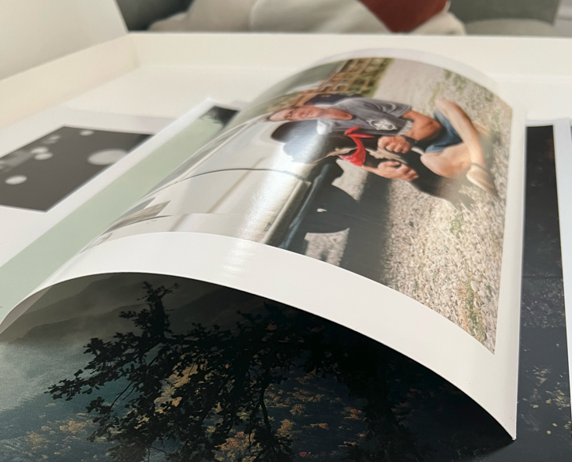
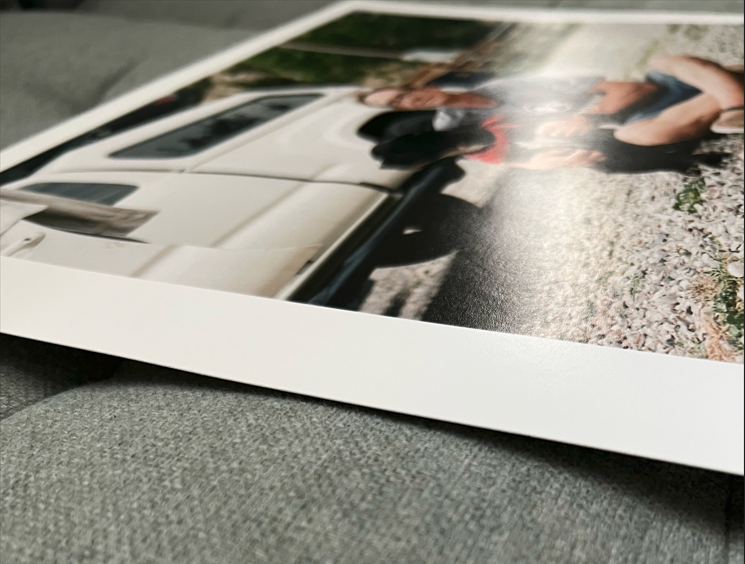

I recently watched a video from Kyle McDougall that talked about preparing film photos for printing at a lab. He used White Wall photo lab in his video and I thought to give them a try since I have not used their service before.

I have done all of my printing at Bay Photo Lab in the past. I order one print and it was delivered in two days. Once I open the print I see the entire print is curved. 

As you can see there is a large curve in the print. The packaging was only a several folded piece of cardboard and the print was not taped down to a backboard. The package itself was not damaged nor was the print.

I was upset to see the curved photo because what am I supposed to do -- risk creasing, bending, or warping the image to make it lay flat again? Well that is exactly what they told me. 

Here is the email exchange with them

> Hello,
>
>I received my order today and the print itself is curved. The delivery was quick and the cardboard packaging was not damaged at all. 
>
>Is this the expectation to have curved prints like this? I have used other online fine art print services online and I have not had curved prints this badly. 
>
>I am trying to understand if this is a quality issue or this is the expected outcome? I don't really know how to fix a curved print easily. I am not planning on framing this print. It is for archival reasons. 
>
>I've attached photos below to show how bad the curve is after taking it out of the packaging. 
>Note: The prints in the background are not from this order, this is my archival box. 

Their response

>Dear Kevin,
> 
>Thank you for your e-mail. We are sorry to hear that your order was delivered curved. In this case, we recommend putting your print back in its protective sheet and then putting a weight on the surface of your print. It should normally come back to a flat position after a few days. 
> 
>As a gesture of goodwill, we have saved a Free Shipping voucher in your customer account. It is valid for three months and must be redeemed in the shopping cart.
> 
>Please accept our apologies for this inconvenience.
>With kind regards | sincèrement

They completely dodged my question. I asked "Is this the expectation to have curved prints like this?" and "I am trying to understand if this is a quality issue or this is the expected outcome?" they refused to answer either.

I have no idea why they did not answer the questions. I cannot order prints from them knowing they come curved and they did not inform me on their website or through customer service about this issue. 

Bay Photo Lab's print came flat. 

